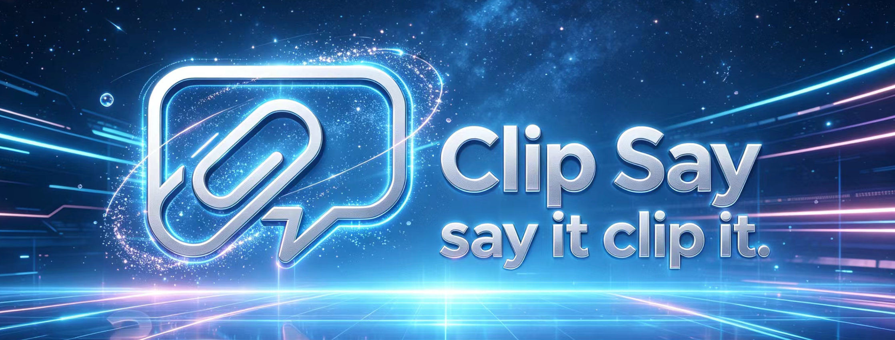
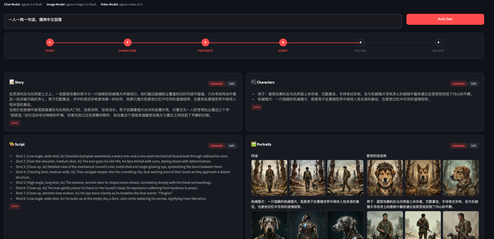

<div align="center">



# Clipsay

### Say it. Clip it.

Describe an idea in plain words, get a finished short video back.
Multi-agent storyboarding, character design, image-to-video synthesis, and
final assembly — all wired through a Streamlit production console.

</div>

---

## What it is

Clipsay turns a one-line idea into a cut-ready video. You write the premise;
the system writes the story, draws the characters, plans the shots, generates
the frames, animates them, and stitches the result.

- **Idea to video, end to end** — idea, story, characters, script, frames, clips, assembly.
- **Live production console** — a Streamlit app that shows every step in a timeline and lets you re-run any stage.
- **Pluggable models** — swap chat, image, and video backends per project via a single YAML.

## How a clip is made

1. **StoryDeveloper** expands the idea into a structured story.
2. **Character extractor** pulls the cast and writes a brief for each.
3. **Portrait generator** renders front / back / side reference sheets so every later shot stays consistent.
4. **Script planner + storyboard artist** cut the story into scenes, beats, and camera moves.
5. **Camera image generator + best-frame selector** produce the opening frame for each beat, with MLLM-based rejection sampling.
6. **Image-to-video renderer** animates first-frame -> last-frame, then `moviepy` concatenates the final cut.

State is cached per clip under `.working_dir/clips/<id>/`, so re-runs only
recompute what you tell them to.

The whole flow runs inside the production console — idea box at the top,
6-stage timeline across the middle, one card per stage with its own
generate / edit controls:

<div align="center">
  
</div>

## Quickstart

Requires Python 3.12 and [uv](https://docs.astral.sh/uv/).

```bash
git clone https://github.com/<your-org>/Clipsay.git
cd Clipsay
uv sync
uv run streamlit run streamlit_app/main.py
```

The app opens on a grid of clips. Pick **Create New Idea**, describe what you
want, and watch the production timeline fill in: Story -> Characters ->
Portraits -> Script -> Editing -> Release.

## Configure

All model wiring lives in `configs/i2v_settings.yaml`. Open the in-app
**Settings** panel (top right) to pick a chat, image, and video model and
paste API keys — selections are written back to the YAML.

```yaml
chat_model: agnes-2.0-flash      # script + planning
image_model: agnes-image-2.0-flash  # character portraits, first frames
video_model: agnes-video-v2.0    # first-frame -> last-frame animation
```

Out of the box the file ships presets for:

- **Agnes AI** — `model_provider: agnes`, base URL `https://apihub.agnes-ai.com/v1`. Vision-capable chat at `agnes-2.0-flash` is verified safe for the selector agents.
- **MiniMax** — `model_provider: minimax`, models `MiniMax-M3` (recommended) and `MiniMax-M2.7` (1M context).
- **OpenAI-compatible** — any provider that speaks the `/v1/chat/completions` and `/v1/images/generations` shapes.

You can also export keys instead of pasting them:

```bash
export AGNES_API_KEY=...
export MINIMAX_API_KEY=...
export OPENAI_API_KEY=...
```

## Programmatic use

The Streamlit app calls into the same pipeline everyone else does:

```python
import asyncio
from pipelines.idea_pipeline import IdeaPipeline

pipeline = IdeaPipeline.init_from_config("configs/idea2video_agnes.yaml")

final_video = asyncio.run(pipeline(
    idea="A cat and a dog who are best friends meet a new cat at the park.",
    user_requirement="For children. No more than 3 scenes.",
    style="Cartoon",
))
print(final_video)  # path to the rendered .mp4
```

## Project layout

```
agents/         screenplay, character, storyboard, selector agents
schemas/        typed data models (clip, scene, shot, frame, character, ...)
pipelines/      idea_pipeline, scene_pipeline
clients/        image / video generator adapters and render backend
streamlit_app/  the production console (main.py + pages/ + widgets/)
utils/          rate limiter, retry, provider presets, image + video helpers
configs/        model presets and pipeline config
.working_dir/   per-clip cache, written at runtime
```

## Status

Shipped and runnable:

- Idea-to-video with character consistency and per-shot best-frame selection.
- Streamlit console with clip library, production timeline, portrait gallery.
- Agnes / MiniMax / OpenAI-compatible model presets.

Still cooking:

- Novel-to-video and script-to-video as first-class UI flows (pipeline code exists, UI is pending).
- Audio and music binding.
- Cameo / reference-photo mode.
  
## License

MIT.
