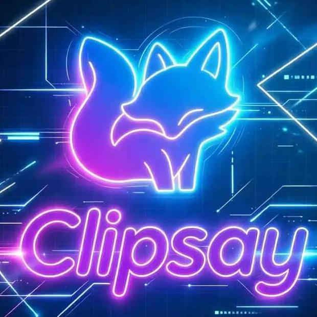
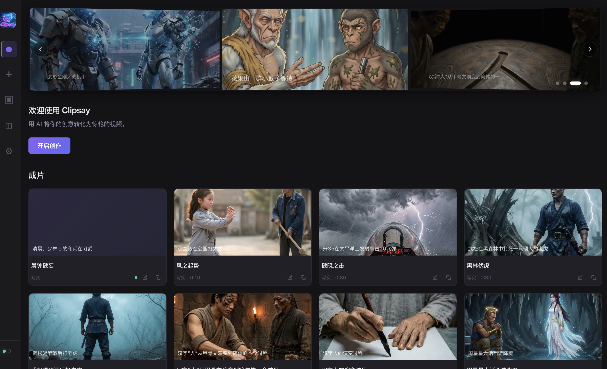
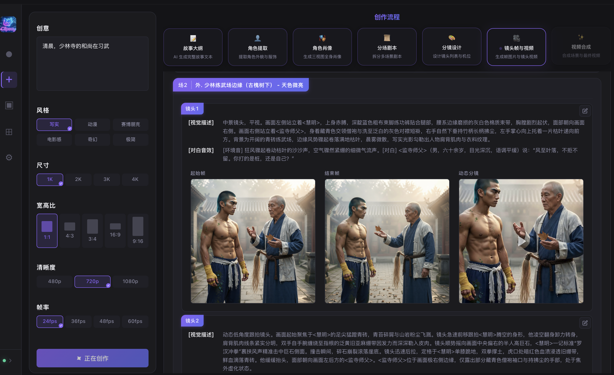

# Clipsay — AI-Powered Video Creation Tool

> **Say it, clip it.** Turn your ideas into stunning videos with AI.

Clipsay is an AI-driven video creation desktop application with a complete pipeline from concept to finished video. Drop in a creative idea, and AI handles the entire workflow: story generation, character design, portrait generation, storyboarding, shot frame generation, and video compositing.



## Tech Stack

| Layer | Technology |
|-------|-----------|
| Frontend | Electron + React 18 + TypeScript |
| Build | electron-vite + Vite |
| Backend | Python 3.13 + FastAPI |
| Database | SQLite (aiosqlite) |
| AI Pipeline | 7-step pipeline with real-time SSE push |
| AI Providers | Agnes (Image / Video) |

## Quick Start

### Prerequisites

- Node.js >= 18
- Python >= 3.13
- [uv](https://docs.astral.sh/uv/) (Python package manager)

### Installation

```bash
# Clone the repository
git clone <repo-url> && cd clipsay

# Install frontend dependencies
npm install

# Install backend dependencies
cd backend
uv sync
cd ..
```

### Start Development Mode

```bash
npm run dev
```

This starts concurrently:
- Vite dev server (renderer, default `localhost:5173`)
- Electron main process (auto-starts the Python backend)
- Python FastAPI backend (default `localhost:8765`)

### Build

```bash
npm run build
```

## Project Structure

```
clipsay/
├── src/
│   ├── main/           # Electron main process
│   │   └── index.ts    # Window management, backend process, IPC
│   ├── preload/        # Electron preload script
│   └── renderer/       # React frontend
│       ├── App.tsx           # Main app (page routing)
│       ├── NewProject.tsx    # Creation page (pipeline control)
│       ├── Carousel.tsx      # Home page carousel
│       ├── CharacterCard.tsx # Character portrait card
│       ├── ShootingScriptCard.tsx # Shooting script card
│       ├── PipelineControls.tsx  # Pipeline control panel
│       ├── usePipelineSSE.ts # SSE event hook
│       └── ...
├── backend/
│   ├── main.py         # FastAPI entry point
│   ├── api/            # REST API + SSE endpoints
│   │   ├── routes.py   # Project/character/storyboard API
│   │   └── pipeline.py # Pipeline control + SSE event stream
│   ├── pipeline/       # AI pipeline core
│   │   ├── runner.py         # Pipeline runner
│   │   ├── step_registry.py  # Step registry
│   │   ├── scene_storyboard.py # Storyboard generation
│   │   ├── frame_generator.py  # Shot frame generation
│   │   ├── events.py         # EventBus / SSE events
│   │   ├── conductor/        # Phase coordinators
│   │   ├── composite/        # Video compositing
│   │   └── steps/            # Step implementations
│   ├── services/       # AI services
│   │   ├── story_writer.py      # Story generation
│   │   ├── character_generator.py # Character extraction
│   │   ├── portrait_service.py    # Portrait generation
│   │   ├── storyboard_generator.py # Storyboard design
│   │   ├── reference_picker.py # Reference image selection
│   │   └── video_compositor.py   # Video compositing
│   ├── clients/        # AI API clients
│   │   ├── image.py    # Image generation (RateQueue)
│   │   ├── video.py    # Video generation (RateQueue)
│   │   ├── llm.py      # LLM invocation
│   │   ├── rate_limiter.py  # RPM/RPD rate limiting
│   │   └── providers/  # Provider implementations
│   ├── db/             # Database layer
│   │   ├── _schema.py  # Table definitions
│   │   ├── projects.py # Project CRUD
│   │   └── storyboards.py # Storyboard data
│   └── schemas/        # Pydantic models
│       ├── character.py
│       ├── camera.py
│       └── shot_spec.py
└── assets/             # Static assets
```

## AI Pipeline Flow

```
idea → story → characters → portraits → scene_scripts → storyboard → shot_frames → composite_video
```

| Step | Description | Input | Output |
|------|-------------|-------|--------|
| `story` | Story outline generation | User idea | story_content |
| `characters` | Character extraction | Story | Character list + appearance/attire |
| `portraits` | Character portrait generation | Character description | Front/side/back 3-view portraits |
| `scene_scripts` | Scene script writing | Story + characters | Multi-scene scripts |
| `storyboard` | Storyboard design | Script + characters | Shot list + camera tree |
| `shot_frames` | Shot frames + video | Storyboard + portraits | Start/end frame + shot video |
| `composite_video` | Video compositing | Shot videos | composite.mp4 |



### Error Handling

- Storyboard failures auto-retry up to 3 times (exponential backoff), then pipeline pauses
- Frame/video generation failures auto-retry up to 3 times, then pipeline pauses
- API 5xx errors auto-retry (ServerError → RateQueue backoff)
- Side/back portrait failures don't affect the front view — graceful degradation

## API

| Endpoint | Description |
|----------|-------------|
| `GET /health` | Health check |
| `GET /api/projects` | List projects |
| `POST /api/projects` | Create project |
| `GET /api/projects/{id}` | Project detail (full data) |
| `PUT /api/projects/{id}` | Update project |
| `POST /api/projects/{id}/duplicate` | Duplicate project |
| `GET /api/projects/{id}/pipeline/events` | SSE event stream |
| `POST /api/projects/{id}/pipeline/start` | Start pipeline |
| `POST /api/projects/{id}/pipeline/pause` | Pause pipeline |
| `POST /api/projects/{id}/pipeline/resume` | Resume pipeline |
| `POST /api/projects/{id}/pipeline/cancel` | Cancel pipeline |
| `POST /api/projects/{id}/pipeline/regenerate-step` | Retry single step |
| `GET /api/projects/{id}/pipeline/status` | Pipeline status |

Full API docs: visit `http://localhost:8765/docs` after starting the backend.

## SSE Event Protocol

The pipeline pushes real-time status updates via SSE:

| Event Type | Description |
|------------|-------------|
| `pipeline_started / completed / failed / paused` | Pipeline lifecycle |
| `step_start / complete / failed` | Step status |
| `emit_progress` | Progress update |
| `portrait_image_status` | Portrait generation status (per character/view) |
| `storyboard_scene_ready` | Scene storyboard completed |
| `shot_frame_ready` | Shot frame status (generating / done) |
| `shot_video_ready` | Shot video status (generating / done) |
| `scene_composite_ready` | Scene composite status (generating / done) |
| `final_video_ready` | Final video ready |

## License

MIT